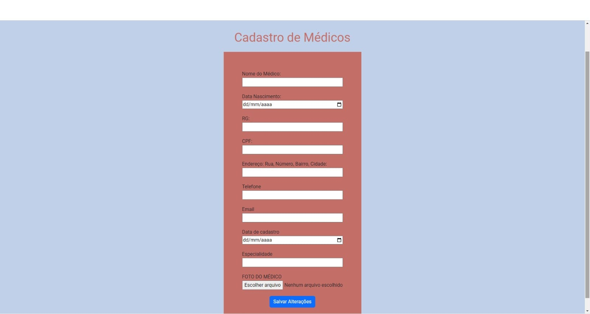
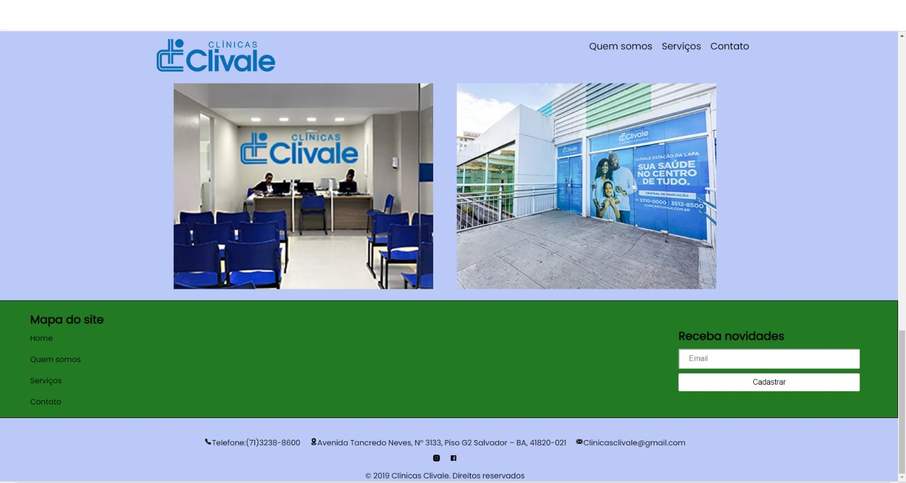

# Sistema de Clínica

Este é um projeto experimental de sistema para uma clínica que inclui apenas HTML e CSS.







## Instalação

1. Clone o repositório:

   ```bash
   git clone https://github.com/seu-usuario/clinica.git
   
2. Abra o index.HTML
